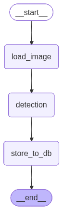
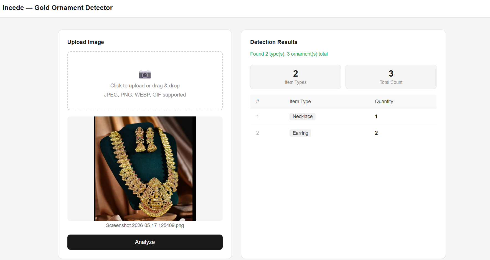

# Ornament Detection

A simple AI-powered ornament detection project built with Python.  
The application allows users to upload an image, detect ornaments from the image, and store the detected results in a database.

## Features

- Upload image support
- Detect ornaments from uploaded images
- Store detection results in SQLite database
- Simple web interface using HTML templates
- Modular project structure

## Project Structure

```bash
ornament detection/
│── main.py
│── graph.py
│── database.py
│── schemas.py
│── detection.db
│── pyproject.toml
│── README.md
│
├── nodes/
│   ├── load_image.py
│   ├── detect_items.py
│   └── save_to_db.py
│
├── templates/
│   └── index.html
│
└── static/screenshots
```

## AGENT FLOW



## Nodes

### 1. `load_image`
**File:** `nodes/load_image.py`

- Validates the uploaded image.
- Checks whether the image exists and is not empty.
- Verifies supported image formats:
  - JPEG
  - PNG
  - JPG
  - WEBP
- Passes the validated state to the next node.

---

### 2. `detection`
**File:** `nodes/detect_items.py`

- Converts the uploaded image into Base64 format.
- Sends the image to the Groq LLM vision model.
- Detects gold ornaments from the image.
- Identifies ornament types such as:
  - ring
  - bangle
  - chain
  - necklace
  - earring
  - bracelet
  - anklet
  - coin
  - other
- Returns structured detection results with quantities.

---

### 3. `store_to_db`
**File:** `nodes/save_to_db.py`

- Stores detected ornament details into the SQLite database.
- Saves:
  - filename
  - ornament type
  - quantity
  - timestamp
- Commits all detection records into the `detections` table.

---

## Installation

### 1. Clone the repository

```bash
git clone <your-repo-url>
cd "ornament detection"
```

### 2. Create virtual environment

```bash
uv will automatically create a virtual environment (.venv)
```

### 3. Activate virtual environment

#### Windows

```bash
.venv\Scripts\activate
```

#### Linux / Mac

```bash
source .venv/bin/activate
```

### 4. Install dependencies

```bash
uv add -r requirements.txt
```

## Run the Project

```bash
python main.py
```

The server will start locally.

## UI


```

## Technologies Used

- Python
- FastAPI / Flask
- SQLite
- HTML
- AI Image Detection
- UV


